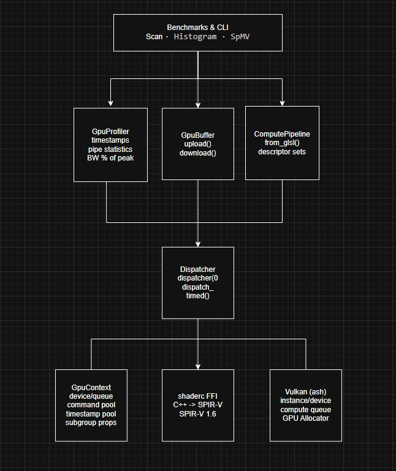

# GPU Compute Runtime 💀

A GPU compute runtime built from scratch. Compiles shaders, dispatches them on the GPU, and profiles performance, all from Rust with a C++ compiler frontend.

## What even is this

Your CPU has a handful of really fast cores. Your GPU has thousands of simpler ones, all designed to work at the same time. Most people only use their GPU for games and video rendering and stuff, but it can run any kind of computation like physics simulations, sorting algorithms, fractal rendering, machine learning.

This project lets you write programs that runs on your GPU, from scratch. You write the logic in GLSL, a C++ frontend compiles it into SPIR-V, and a Rust runtime talks directly to the Vulkan driver to dispatch your code onto the hardware. No PyTorch, no CUDA, no framework getting in the way. Works on NVIDIA, AMD, and Intel GPUs without picking sides.

It also profiles every single dispatch. Instead of measuring time with a stopwatch (which includes the CPU overhead of telling the GPU what to do), it asks the GPU directly: "how long did that actually take you?" using Vulkan's hardware timestamp queries and pipeline statistics. It computes what percentage of your GPU's peak memory bandwidth you're burning through, and pushes the results to a live dashboard that updates every time you run the benchmarks.

As a demo, it renders deep-zoom Mandelbrot fractals, 4096×4096 pixels of seahorse-valley spirals, each pixel computed by a separate GPU thread, blazing through 2000 iterations in about 4 milliseconds. Good luck doing that on a CPU 💀.

---

## Architecture



- **Rust runtime** (`runtime/`): Library crate that talks to Vulkan via `ash`. Device setup, buffer management (host visible, persistent mapped), shader pipeline creation, dispatch, timestamp/pipeline-statistics profiling.
- **C++ compiler frontend** (`compiler/`): Compiles GLSL to SPIR-V via `shaderc` with a C ABI bridge (`extern "C"`). Includes hand written preprocessor and unroller passes.
- **Kernels** (`kernels/benchmarks/`): Compute shaders: 3 pass parallel prefix sum (warp shuffle or shared memory fallback), PRSG histogram, tiled/naive sparse matrix vector multiply.
- **Demos** (`kernels/demos/`, `runtime/src/demos/`): GPU-accelerated Mandelbrot set renderer with fp64 deep-zoom support. CLI: `cargo run -- mandelbrot --zoom seahorse --width 4096 --iters 5000`. See [`docs/mandelbrot.md`](docs/mandelbrot.md).
- **Dashboard** (`docs/WebPage/chart.js/`): Vite + Chart.js app. Reads `bench_results.json` and renders interactive bar charts (CPU vs GPU wall vs GPU timestamp). Auto deployed via GitHub Actions. Demos tab includes the rendered Mandelbrot image with a comparison table.

---

## Build

### Prerequisites

- Rust 1.75+ (`rustup`)
- Vulkan SDK 1.3+ ([LunarG](https://vulkan.lunarg.com/))
- A GPU with Vulkan compute support
- +- Node.js 20+ / npm for the dashboard

Verify:

```bash
vulkaninfo --summary
cargo check --manifest-path runtime/Cargo.toml
```

### Commands

```bash
cargo build --manifest-path runtime/Cargo.toml        # compile
cargo test  --manifest-path runtime/Cargo.toml        # all tests
cargo test  --manifest-path runtime/Cargo.toml --     # benchmarks (writes bench_results.json)
             --test benchmark_test -- --nocapture
```

Make targets:

| Target            | Does                                              |
| ----------------- | ------------------------------------------------- |
| `make check`      | `cargo check`                                     |
| `make test`       | `cargo check` + `cargo test`                      |
| `make bench`      | run benchmarks with `--nocapture`                 |
| `make dashboard`  | `npm run dev` (Chart.js live dashboard)           |
| `make mandelbrot` | render the Mandelbrot set (1920×1080, 1000 iters) |
| `make clean`      | `cargo clean` + delete generated .spv/.json files |

---

## Benchmarks

All benchmarks run on an **NVIDIA GeForce RTX 2060 SUPER** (peak memory bandwidth: 448 GB/s, subgroup size: 32). Timed loops average 10 iterations. **GPU wall** is wall clock time per iteration. **GPU pure** is the Vulkan timestamp delta (TOP_OF_PIPE → COMPUTE_SHADER), excluding dispatch overhead. **Invocations** counts compute shader thread invocations from pipeline statistics queries.

| Benchmark                    | GPU wall (ms) | GPU pure (ms) | Invocations | Speedup vs CPU |
| ---------------------------- | ------------- | ------------- | ----------- | -------------- |
| Scan (1M u32)                | 1.30          | 0.87          | 2,101,248   | 5.89×          |
| Histogram (1M samples)       | 0.70          | 0.56          | 1,048,576   | 17.27×         |
| SpMV (262K², 4.2M nnz)       | 3.19          | 3.03          | 8,388,608   | 29.67×         |
| Mandelbrot (1024², 200 iter) | 0.54          | 0.38          | 1,048,576   | 262.67×        |

See [`docs/Benchmarks/`](docs/Benchmarks/) for per-benchmark descriptions: algorithm, shader architecture, historical results from v1 (pipeline recreation every call) to v2 (pre-cached + profiled), and links to academic references. The Mandelbrot demo is documented separately at [`docs/mandelbrot.md`](docs/mandelbrot.md).

---

## Design Decisions

### Architecture & Tooling

- **Vulkan over CUDA**: vendor agnostic. Mirrors how Qualcomm, Intel, and AMD compute compiler teams target multiple GPU architectures from a single codebase.
- **`ash` over `vulkano`**: `ash` is a thin zero-overhead wrapper over the raw Vulkan API. More boilerplate, but closer to the C API that GPU compute job postings expect.
- **Explicit `destroy_*` over `Drop`**: Vulkan requires reverse-order teardown (Allocator → Device → Instance). Using `ManuallyDrop` + explicit destroy methods avoids lifetime complexity.
- **Host-visible, persistent-mapped memory**: `upload()`/`download()` use `ptr::copy_nonoverlapping` directly into mapped GPU memory. No staging buffers, no extra copies.
- **`extern "C"` FFI bridge**: C++ shader compiler compiled via `cc` in the build script, exposed to Rust through a minimal C ABI. No bindgen complexity.

### Shader Selection & Subgroup Optimization

- **Automatic shader variant selection**: `GpuContext` queries `VkPhysicalDeviceSubgroupProperties` at init. If `subgroup_arithmetic` is present, benchmarks auto load warp shuffle scan and tiled SpMV shaders. No user configuration, no compile flags.
- **SPIR-V 1.6 target**: `shaderc` defaults to SPIR-V 1.0 even when targeting Vulkan 1.3. Subgroup operations require SPIR-V 1.3+. The C++ bridge calls `options.SetTargetSpirv(shaderc_spirv_version_1_6)` on every compilation.
- **Warp shuffle scan**: When subgroup arithmetic is available, scan replaces a 3 pass shared-memory stride tree with 2× `subgroupInclusiveAdd()` + barriers. Eliminates shared memory traffic. Falls back to the 3 pass shared memory variant on GPUs without subgroup support.
- **Tiled vs naive SpMV**: Naive: 1 thread per CSR row. Tiled: 1 warp (subgroup) per row, using `subgroupAdd` for cooperative reduction across non zeros. Workgroup count adapts automatically to `ceil(rows / (WG_SIZE/subgroup_size))`.
- **`subgroupInclusiveAdd` not `gl_SubgroupInclusiveAdd`**: GLSL built in functions don't carry the `gl_` prefix. Only variables do. Using `gl_SubgroupInclusiveAdd` triggers a reserved identifier compile error.

### Profiling & Observability

- **Vulkan timestamp queries**: `GpuProfiler` inserts `vkCmdWriteTimestamp` calls (TOP_OF_PIPE before dispatch, COMPUTE_SHADER after) into the command buffer. Delta gives pure GPU execution time, excluding CPU dispatch overhead.
- **Vulkan pipeline statistics**: `GpuProfiler` wraps `vkCmdBeginQuery`/`vkCmdEndQuery` around every dispatch with `COMPUTE_SHADER_INVOCATIONS_BIT`. Reports thread level work granularity alongside time.
- **Peak bandwidth via GPU-name lookup**: Vulkan doesn't expose memory clock speed or bus width. Peak bandwidth is derived from a 39 entry lookup table (NVIDIA RTX 20/30/40-series, AMD RDNA1-3, Intel Arc). Falls back to 100 GB/s for unknown GPUs; override via `set_peak_bandwidth()`.
- **Chart.js live dashboard**: Benchmarks write `bench_results.json`. A Vite + Chart.js dashboard reads it and renders interactive bar charts (CPU vs GPU wall vs GPU pure time). Auto deployed to GitHub Pages on every push via `.github/workflows/deploy-dashboard.yml`.

### Performance Architecture

- **Pipeline caching (v2)**: `ScanState`, `HistogramState`, and `SpmvState` structs pre-create pipelines, descriptor sets, dispatchers, and buffers at init. The timed loop only dispatches zero creation or destruction inside the loop. Eliminated 100–150× overhead vs creating everything per call.
- **GPU-only broader test data**: All correctness test uploads fill ≥256 elements (one full workgroup) to prevent stale buffer reads from adjacent positions in previous dispatches.
- **Persistent command buffer reuse**: `Dispatcher::dispatch` and `dispatch_timed` both call `reset_command_buffer` internally. A single dispatcher instance is reusable across all iterations, no per-dispatch allocation.
